# Automation Framework with Cucumber

1. [BDD  Behaviour Driven Development](#bdd--behaviour-driven-development)
    1. [Benefit of BDD](#benefit-of-bdd)
    2. [Gherkin](#gherkin)
    3. [Step Definitions](#step-definitions)
2. [Cucumber Maven Project](#cucumber-maven-project)
    1. [Setting up project](#setting-up-project)
    2. [Adding Selenium Related Dependencies and classes](#adding-selenium-related-dependencies-and-classes)
3. [Cucumber Java with Selenium](#cucumber-java-with-selenium)
    1. [First Selenium Scenario](#first-selenium-scenario)
    2. [Hooks](#hooks)
    3. [More Scenarios and IntelliJ Step Definition generation](#more-scenarios-and-intellij-step-definition-generation)
    4. [Using Parameters with Cucumber Expression](#using-parameters-with-cucumber-expression)
    5. [Using `Background` to reuse `Given` condition](#using-background-to-reuse-given-condition)
    6. [Cucumber Tags](#cucumber-tags)
        1. [Tag expressions](#tag-expressions)
    7. [Creating TestRunner](#creating-testrunner)
    8. [Data tables](#data-tables)
    9. [Scenario Outline with Example](#scenario-outline-with-example)
    10. [Adding Screenshot to Failed Scenarios](#adding-screenshot-to-failed-scenarios)
    11. [Rerunning Failed Scenario](#rerunning-failed-scenario)
    12. [Using Third-Party HTML Reporter](#using-third-party-html-reporter)
    13. [Simple Maven Commands](#simple-maven-commands)

# BDD  Behaviour Driven Development

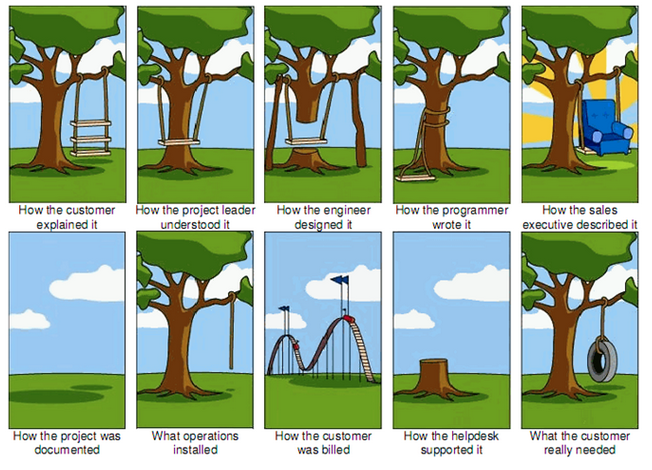

Behaviour Driven Development (or BDD) is a powerful collaborative methodology that helps teams focus on delivering high value features sooner and more reliably.

BDD builds on and extends standard agile practices such as sprint planning and backlog grooming, user stories and acceptance criteria, and makes them much more effective.

## Benefit of BDD
- Clear communication
- Fewer defects
- Higher quality, more innovative solutions
- Higher quality, easier to maintain automated test suites
- Documentation that is always up-to-date

Here is how typical process look like :

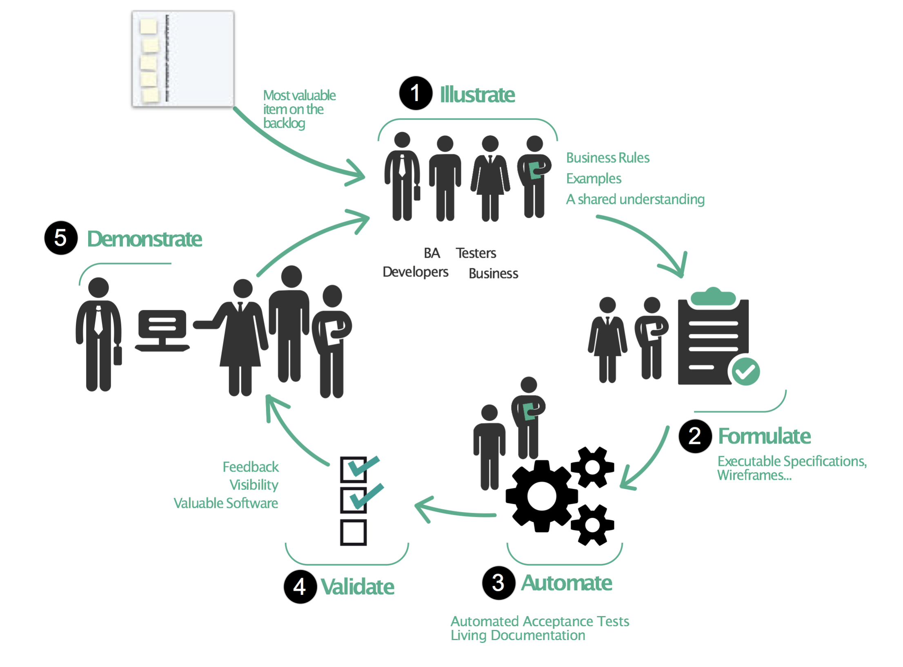

Teams practicing BDD work together to discover and understand the real business needs behind a user story or feature.
- They explore the requirement by discussing examples and counter-examples of user and system behaviour with the business.
- This happens during a workshop often known as the "**Three-Amigos**" meeting
- The purpose of the **Three Amigos** workshop is not only to build up a deep shared understanding within the team, but also to uncover areas of uncertainty or incorrect assumptions that would typically only surface much later on.
- Teams often use techniques such as **Example Mapping** and **Feature Mapping** to facilitate the requirements discovery process.

The concrete examples that are created collaboratively in discovery workshops can be used to automatically verify that the software behaves consistently with these examples.

This happens by expressing those examples as executable software specifications in plain language that everyone on the team can understand using `Gerkin` Language.

## Gherkin
Gherkin is a set of grammar rules that makes plain text structured enough for Cucumber to understand.

Syntax usually follow this pattern

```gherkin
Given some condition is defined
When some actions are taken 
Then some result should be expected
```

For example:

```gherkin
Feature: Etsy search functionality
  Agile Story: User should be able to type any keyword and see relevant information

  Scenario: Etsy Search Functionality Title Verification (without parameterization)
    Given user is on the Etsy homepage
    When user types Wooden Spoon in the search box
    And user click to Etsy search button
    Then user sees Wooden Spoon is in the title
```

The specific examples (scenarios) of a Feature is written in `Gerkin`
in a `Feature` file (a file with .feature extension).

Here is the [Gherkin reference doc](https://cucumber.io/docs/gherkin/reference/).

These specifications (called scenarios) are then executed by tools (That's the reason it's also called executable specification)
and That's where **cucumber** comes in.

[Cucumber](https://cucumber.io/docs/cucumber/) is a tool to support the BDD Process
and write automated acceptance test to provide fast feedback.

Cucumber reads executable specifications written in plain text Gherkin
and validates that the software does what those specifications say.


Cucumber support couple languages java , js , ruby and so on.
we will be using cucumber for java cucumber-jvm.

## Step Definitions
A Step Definition is a Java method with an expression that links it to one or more Gherkin steps. When Cucumber executes a Gherkin step in a scenario, it will look for a matching step definition to execute.

A step definition carries out the action that should be performed by the step.
So step definitions hard-wire the specification to the implementation.

```
┌────────────┐                 ┌──────────────┐                 ┌───────────┐
│   Steps    │                 │     Step     │                 │           │
│ in Gherkin ├──matched with──>│ Definitions  ├───manipulates──>│  System   │
│            │                 │              │                 │           │
└────────────┘                 └──────────────┘                 └───────────┘
```

For example :

```feature
Given user is on the Etsy homepage
```

will match a java method as below

```java
  @Given("user is on the Etsy homepage")
public void user_is_on_the_etsy_homepage() {
        Driver.getDriver().get("https://www.etsy.com");
        }
```

And this step

```gherkin
 When user types Wooden Spoon in the search box
```

will match a java method as below

```java
  @When("user types Wooden Spoon in the search box")
public void user_types_wooden_spoon_in_the_search_box() {
        etsyHomePage.searchBox.sendKeys("Wooden Spoon");
        }
```

Steps can be reused as long as the definition matches.

The steps can be parameterized as well for example , instead of creating new steps for adding different number , we can use the cucumber expression to parameterize as below

```java
   @When("user enters {string} in the Bing search box")
public void userEntersInTheBingSearchBox(String searchKey) {

        bingSearchPage.searchBox.sendKeys(searchKey + Keys.ENTER);

        }
```

Above step definition can be used for all steps below

```gherkin
 When user enters "orange" in the Bing search box
 When user enters "selenium" in the Bing search box
 When user enters "webdriver" in the Bing search box
```

Here are the other parameter type available :
- `{int}`	Matches integers, for example 71 or -19.
- `{float}`	Matches floats, for example 3.6, .8 or -9.2.
- `{byte}`, `{short}`, `{long}` and `{double}`.
- `{word}`	Matches words without whitespace, for example banana (but not banana split).
- `{string}`	Matches single-quoted or double-quoted strings, for example "banana split" or 'banana split' (but not banana split). Only the text between the quotes will be extracted. The quotes themselves are discarded.
- {} anonymous


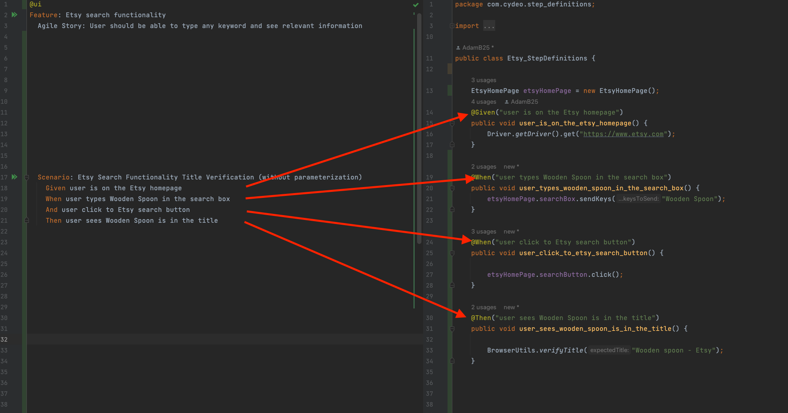


--- 
# Cucumber Maven Project

## Setting up project

1. Create a maven project with name `cydeo-cucumber-junit-project`
    1. Select java 11
    2. group id : `com.cydeo`
    3. artifact id : leave it as is
    4. Click Create
   
       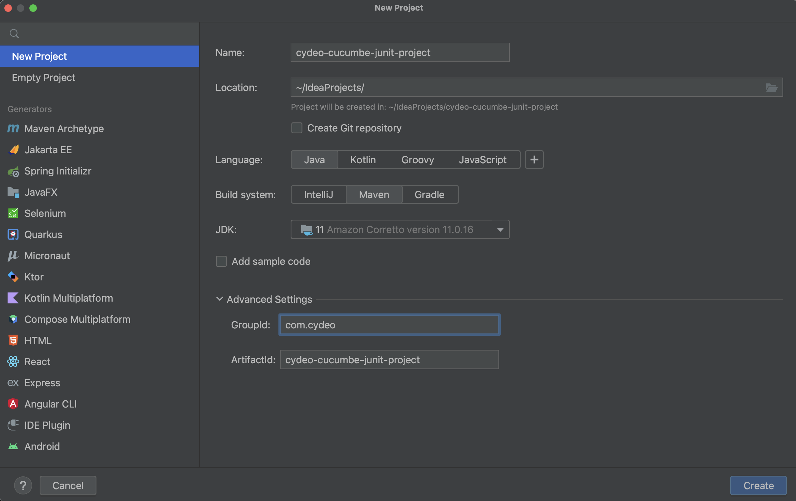
2. create folder structure as below
    1. under `src/test/java` create below packages
    2. create a package `com.cydeo` ,under this package
        1.  create `utilities` package
        2.  create `pages` package
        3.  create `step_definitions` package
        4.  create `runners` package
3. create a directory(folder) under `src/test`
    1. when asked for the name , select `resources` from dropdown it provided
    2. under resources create a folder `features`

   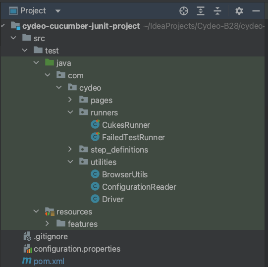
4. add dependencies into your `pom.xml`
    1. `cucumber java` dependency
    ```xml
        <!-- https://mvnrepository.com/artifact/io.cucumber/cucumber-java -->
        <dependency>
            <groupId>io.cucumber</groupId>
            <artifactId>cucumber-java</artifactId>
            <version>7.3.2</version>
        </dependency>
    ```

    2. `cucumber junit` dependency

     ```xml    
      <!-- https://mvnrepository.com/artifact/io.cucumber/cucumber-junit -->
        <dependency>
            <groupId>io.cucumber</groupId>
            <artifactId>cucumber-junit</artifactId>
            <version>7.3.2</version>
            <scope>test</scope>
        </dependency>
     ```

5. Add a feature file called `feature_name.feature` under `src/test/resources/feature`
    1. right click on features folder ---> New ---> File --> GoogleSearch.feature
    2. add below content
    ```feature
     Feature: Google search functionality
     Agile story: As a user, when I am on the Google search page
     I should be able to search anything and see relevant results

     Scenario: Search page default title verification
      When user is on the Google search page
      Then user should see title is Google
    ```


6. Create a new class `Google_StepDefinitions` under step definitions
7. **Run the feature file by using run button beside feature scenario**
8. Copy the code from the console error and remove the content of method with your own
9. run again to see the scenario pass ,

Here is the full [EatStepDef](src/test/java/com/cydeo/step_definitions/Google_StepDefinitions.java) class.

Here is another example [BingSearch.feature](src/test/resources/features/BingSearch.feature) we added
and here is the step definition class [Bing_StepDefinitions](src/test/java/com/cydeo/step_definitions/Bing_StepDefinitions.java) class.

Here is [WikiSearch.feature](src/test/resources/features/WikiSearch.feature)
to demonstrate the parametrizing and reusing steps


## Adding Selenium Related Dependencies and classes

1. add selenium dependency

```xml
     <!-- https://mvnrepository.com/artifact/org.seleniumhq.selenium/selenium-java -->
<dependency>
    <groupId>org.seleniumhq.selenium</groupId>
    <artifactId>selenium-java</artifactId>
    <version>4.8.0</version>
</dependency>
```

- add WebDriverManager Dependency (Don't need WebDriverManager Dependency with Selenium 4)
- but if you want 
 ```xml
 <!-- https://mvnrepository.com/artifact/io.github.bonigarcia/webdrivermanager -->
<dependency>
    <groupId>io.github.bonigarcia</groupId>
    <artifactId>webdrivermanager</artifactId>
    <version>5.3.2</version>
</dependency>

```


- add faker dependency (this is not selenium dependency, we will use it for random data at some point)

```xml
<!-- https://mvnrepository.com/artifact/com.github.javafaker/javafaker -->
<dependency>
    <groupId>com.github.javafaker</groupId>
    <artifactId>javafaker</artifactId>
    <version>1.0.2</version>
</dependency>
```

2. copy all `utilities classes` from previous project under utilities package.
3. copy all `pages` from previous project and place it under pages package.
4. add `configuration.properties` file from previous project.


# Cucumber Java with Selenium

## First Selenium Scenario

Here is the initial feature file we wrote for WebOrder login page

```gherkin
Feature: Web table app login functionality
  Agile story: User should be able to login with correct credentials

  Scenario: Positive login scenario
    Given user is on the Web Table app login page
    When user enters correct username
    And user enters correct password
    And user clicks to login button
    Then user should see orders word in the URL
```

Here is the step definition class we created to match steps

```java
  package com.cydeo.step_definitions;

import com.cydeo.pages.WT_BasePage;
import com.cydeo.pages.WT_LoginPage;
import com.cydeo.pages.WT_OrderPage;
import com.cydeo.pages.WT_ViewAllOrdersPage;
import com.cydeo.utilities.BrowserUtils;
import com.cydeo.utilities.Driver;
import io.cucumber.java.en.And;
import io.cucumber.java.en.Given;
import io.cucumber.java.en.Then;
import io.cucumber.java.en.When;
import org.junit.Assert;
import org.openqa.selenium.Keys;

import java.util.List;
import java.util.Map;

public class WebTable_StepDefinitions {

    @Given("user is on the Web Table app login page")
    public void user_is_on_the_web_table_app_login_page() {
        Driver.getDriver().get("https://web-table-2.cydeo.com/login");
    }

    WT_LoginPage wtLoginPage = new WT_LoginPage();
    @When("user enters correct username")
    public void user_enters_correct_username() {
        wtLoginPage.inputUsername.sendKeys("Test");
    }
    @When("user enters correct password")
    public void user_enters_correct_password() {
        wtLoginPage.inputPassword.sendKeys("Tester");
    }
    @When("user clicks to login button")
    public void user_clicks_to_login_button() {
        wtLoginPage.loginButton.click();
    }
    @Then("user should see orders word in the URL")
    public void user_should_see_orders_word_in_the_url() {
        String actualURL= Driver.getDriver().getCurrentUrl();
        String expectedInURL = "orders";

        Assert.assertTrue(actualURL.contains(expectedInURL));
    }
    }

```

Unlike previous project ,
we do not have test base to automatically set up and teardown driver once we are done.
Browser will not automatically close after test and implicit wait will not be set before scenario run.

So how do we do it ? with cucumber hooks!

## Hooks
Hook is a commonly used term in cucumber
to illustrate the idea of running some code right before and after each scenario.

In our case, we wanted to set up driver and implicit wait before each scenario
and tear down driver after each scenario.

Here is how cucumber does it using **cucumber annotation**
- `@Before` coming from `import io.cucumber.java.Before;`
- `@After` coming from `import io.cucumber.java.After;`

All we have to do is create a class
and add methods with above annotation as below :

```java
pimport io.cucumber.java.*;
import org.openqa.selenium.OutputType;
import org.openqa.selenium.TakesScreenshot;

/*
In this class we will be able to create "pre" and "post" condition
for ALL the SCENARIOS and even STEPS.
 */
public class Hooks {

    //import the @Before coming from io.cucumber.java
    @Before (order = 1)
    public void setupMethod(){
        System.out.println("---> @Before: RUNNING BEFORE EACH SCENARIO");
    }

    //@Before (value = "@login", order = 2 )
    public void login_scenario_before(){
        System.out.println("---> @Before: RUNNING BEFORE EACH SCENARIO");
    }

    /*
    @After will be executed automatically after EVERY scenario in the project.
     */
    @After
    public void teardownMethod(Scenario scenario){

        if (scenario.isFailed()) {

            byte[] screenshot = ((TakesScreenshot) Driver.getDriver()).getScreenshotAs(OutputType.BYTES);
            scenario.attach(screenshot, "image/png", scenario.getName());

        }

        System.out.println("---> @After: RUNNING AFTER EACH SCENARIO");

        BrowserUtils.sleep(2);
        Driver.closeDriver();

    }

    //@BeforeStep
    public void setupStep(){
        System.out.println("-----> @BeforeSTEP : Running before each step!");
    }

    //@AfterStep
    public void teardownStep(){
        System.out.println("-----> @AfterSTEP : Running after each step!");
    }


}

```

**No Inheritance needed anywhere! NEAT!**

Now we can assume it will set up and close the browser for each scenario everywhere.
> note that it will also do that for non-ui scenarios like `calculator.feature`. more on that later with tags.


## Using Parameters with Cucumber Expression

As we did with calculator example ,
it's easy to reuse steps using parameters.

Here is different style of scenario that contains credentials to demonstrate the point.

```gherkin
 Feature: Bing search functionality
  Agile story: As a user, when I am on the Bing search page
  I should be able to search anything and see relevant results

  Scenario: Search result title verification
    Given user is on the Bing search page
    When user enters "orange" in the Bing search box
    Then user should see "orange - Search" in the title
```

So now step definitions will be as below without duplicate

```java
package com.cydeo.step_definitions;

import com.cydeo.pages.BingSearchPage;
import com.cydeo.utilities.BrowserUtils;
import com.cydeo.utilities.Driver;
import io.cucumber.java.en.Given;
import io.cucumber.java.en.Then;
import io.cucumber.java.en.When;
import org.openqa.selenium.Keys;

public class Bing_StepDefinitions {

    BingSearchPage bingSearchPage = new BingSearchPage();

    @Given("user is on the Bing search page")
    public void user_is_on_the_bing_search_page() {

        Driver.getDriver().get("https://www.bing.com");

    }


    @When("user enters {string} in the Bing search box")
    public void userEntersInTheBingSearchBox(String searchKey) {

        bingSearchPage.searchBox.sendKeys(searchKey + Keys.ENTER);

    }

    @Then("user should see {string} in the title")
    public void userShouldSeeInTheTitle(String expectedTitle) {

        BrowserUtils.verifyTitle(expectedTitle);
        //BrowserUtils.verifyTitleContains(expectedTitle);

    }
}
```
How to set parameter from gherkin to step definitions

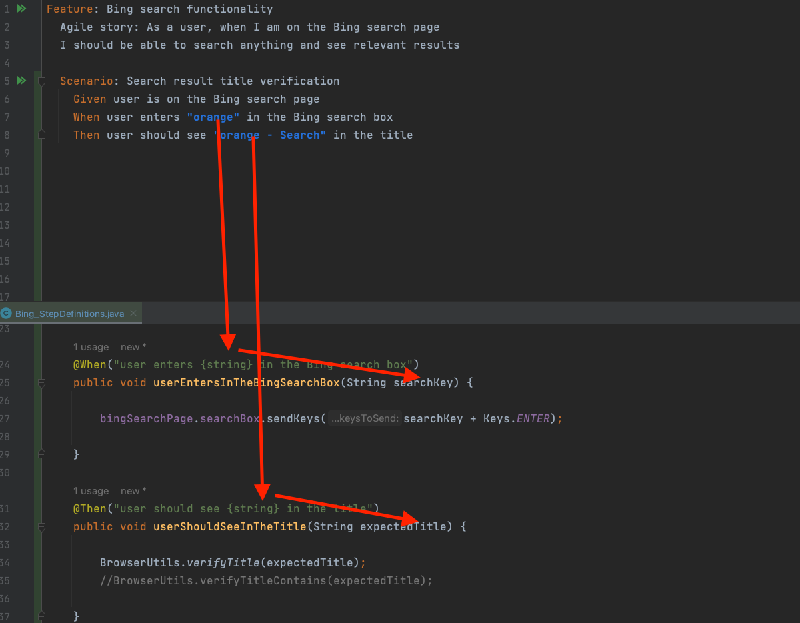

## Using **Background** to reuse Given condition
As we progress in above 4 scenarios,
We found that all of them repeating the below step in `Given` part
```gherkin
Feature: Library login feature

  User Story:
  As a user, I should be able to login with correct credentials to different accounts. And dashboard should be displayed.
  Accounts are: librarian, student, admin
#this is how we comment in feature file

  @librarian @smoke
  Scenario: Login as librarian
    Given user is on the login page of the library application
    When user enters librarian username
    And user enters librarian password
    Then user should see the dashboard

  @student @smoke
  Scenario: Login as student
    Given user is on the login page of the library application
    When user enters student username
    And user enters student password
    Then user should see the dashboard

  @admin @smoke
  Scenario: Login as admin
    Given user is on the login page of the library application
    When user enters admin username
    And user enters admin password
    Then user should see the dashboard

```


```gherkin
Given user is on the login page of the library application
```

So we can reuse this step in each scenario using new keyword `Background`

```gherkin
Feature: Library login feature

  User Story:
  As a user, I should be able to login with correct credentials to different accounts. And dashboard should be displayed.
  Accounts are: librarian, student, admin
#this is how we comment in feature file
  Background: For all scenarios user is on the login page of the library application
    Given user is on the login page of the library application

```

Now we can remove this repeating `Given` section in all scenarios

```gherkin
Feature: Library login feature

  User Story:
  As a user, I should be able to login with correct credentials to different accounts. And dashboard should be displayed.
  Accounts are: librarian, student, admin
#this is how we comment in feature file
  Background: For all scenarios user is on the login page of the library application
    Given user is on the login page of the library application

  @librarian @smoke
  Scenario: Login as librarian
    When user enters librarian username
    And user enters librarian password
    Then user should see the dashboard

  @student @smoke
  Scenario: Login as student
    When user enters student username
    And user enters student password
    Then user should see the dashboard

  @admin @smoke
  Scenario: Login as admin
    When user enters admin username
    And user enters admin password
    Then user should see the dashboard
```

## Cucumber Tags
Tags are a great way to organise your features and scenarios.

They can be used for two purposes:

- Running a subset of scenarios
    - (using test runner in next section)
- Restricting hooks to a subset of scenarios
    - for example only open browser and close browser for scenarios tagged with `@ui`.

    - ```java
      
       @Before (value = "@ui")
       public void login_scenario_before(){
      System.out.println("---> @Before: RUNNING BEFORE EACH SCENARIO");
      }
      
       @After("@ui")
       public void teardownMethod(Scenario scenario){


        System.out.println("---> @After: RUNNING AFTER EACH SCENARIO");

        BrowserUtils.sleep(2);
        Driver.closeDriver();

      }
      
      ```
      
      How tags are working in Hooks

    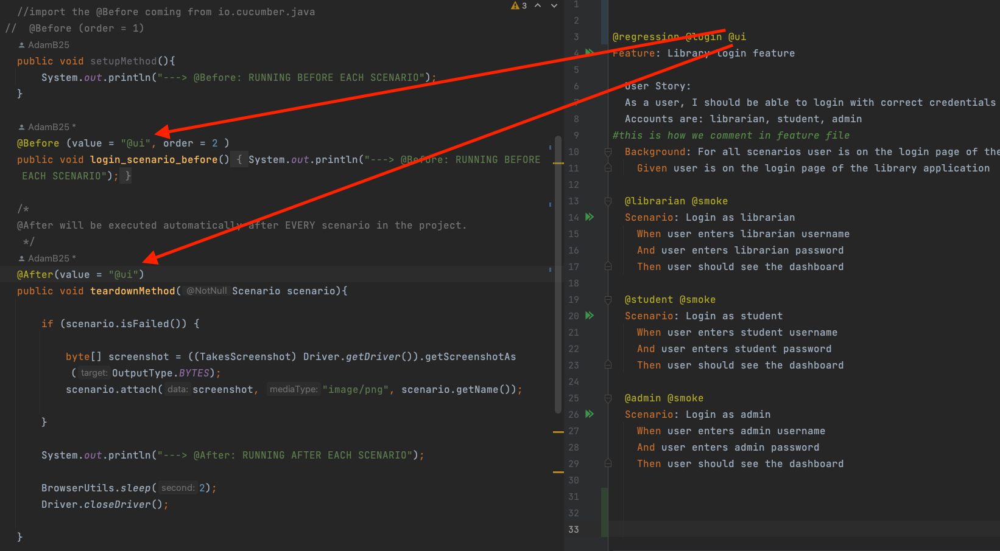

Tags are used in feature file at feature level or scenario level.

Since feature file is not source code,
any tag with any name (without space or reserved characters) can be used.

If a tag is used at feature level ,
all scenarios under same feature will inherit it.

```gherkin
## below line is how we add tag to a feature at feature level
  ## you can add more than one tags on anything
@regression @login @ui
Feature: Library login feature

  User Story:
  As a user, I should be able to login with correct credentials to different accounts. And dashboard should be displayed.
  Accounts are: librarian, student, admin
#this is how we comment in feature file
  Background: For all scenarios user is on the login page of the library application
    Given user is on the login page of the library application

    ## below line is how we add tag to a feature at scenario level
  @librarian @smoke
  Scenario: Login as librarian
    When user enters librarian username
    And user enters librarian password
    Then user should see the dashboard

  @student @smoke
  Scenario: Login as student
    When user enters student username
    And user enters student password
    Then user should see the dashboard

  @admin @smoke
  Scenario: Login as admin
    When user enters admin username
    And user enters admin password
    Then user should see the dashboard
```

### Tag expressions
A tag expression is a boolean expression. Below are some examples:

| Expression            | Description |
|       -----           |   ----      |
| `@fast`               | Scenarios tagged with `@fast` |
| `@wip and not @slow`  | Scenarios tagged with `@wip` that aren’t also tagged with `@slow` |
| `@smoke and @fast`    | Scenarios tagged with both `@smoke` and `@fast` |
| `@ui or @database`    | Scenarios tagged with either `@ui` or `@database` |


## Creating CukesRunner
We have been running the feature directly from the feature file.
While it is convenient to get started,
It will limit ability to have more granular control over what we want to run and how.

Cucumber encourage the usage of separate Test runner class with many built in options

Runner class has only one purpose - run features according to instruction.
It's always empty and use special annotations as below

- `@RunWith(Cucumber.class)` to define this is for running cucumber
- `@CucumberOptions` to define all related configurations

for example :
- where are the feature files :
    - `features = "src/test/resources/features"`
    - alternatively `features = "classpath:features"` **SHORTER!**
        - anything under `src/test/resources` can be referred by `classpath:`
- where are the step definitions (glue code):
    - `glue = "com/cydeo/step_definitions"`
- quick check missing step definitions without actually running steps
    - `dryRun=true`
        - it will only check missing definition and provide it on console if any
        - it will save time by giving immediate check instead of wasting time running the whole thing and find out we have missing step definition.
        - `dryRun=false`
            - it's the default value and will run all scenarios and error out if missing step definition exists
- filter using tags
    - `tags = "@smoke"`
        - run any feature or scenario that tagged with `@smoke`
- html reports , json reports , pretty console report and so on with built-in plugins
    - `plugin = {"html:target/cucumber-reports.html"}`
        - This will generate simple html report under target folder with a name `cucumber-reports.html`
    - `plugin = {"pretty", "html:target/cucumber.html"}`
        - `pretty` plugin will generate colorful console report
    - `plugin = {"pretty", "html:target/cucumber.html","json:target/cucumber.json}`
        - This will generate a report in a format known as `json` (Javascript Object notation)
        - Third party reporting tools can use this report to easily customize the report view with rich ui.
            - for example,  we will use third party reporting from `me.jvt.cucumber.report.PrettyReports` later using this.

- publishing generated built-in html report
    - since cucumber version 6.7+ , it can be published to temporary location publicly to share report with others
        - > It's relatively new service that still in development
    - It can be done simply adding one more cucumber option as `publish=true`
    - 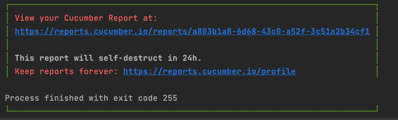
    - Here is the report after clicking on the link
    - 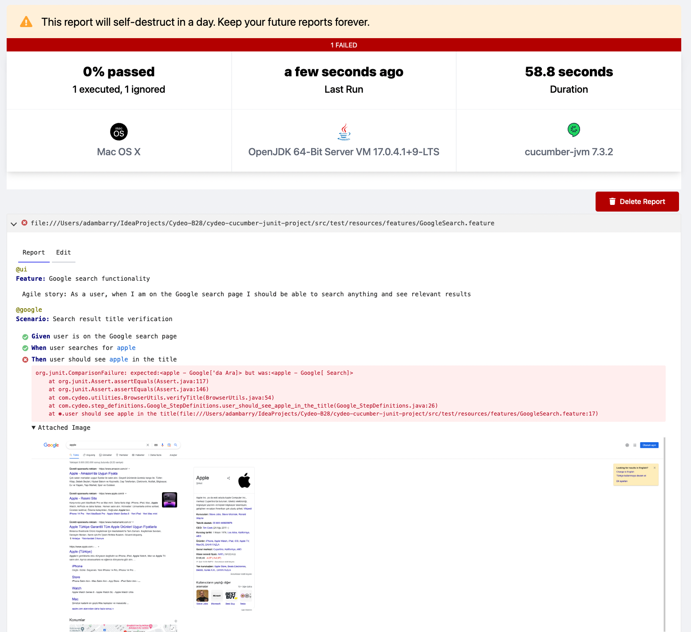

- storing the list of failed scenario for **rerun** later.(instead of running the whole thing). will talk about this separately in it's own section.

```java
  package com.cydeo.runners;

import io.cucumber.junit.Cucumber;
import io.cucumber.junit.CucumberOptions;
import org.junit.runner.RunWith;

@RunWith(Cucumber.class)
@CucumberOptions(
        plugin = {
                "html:target/cucumber-reports.html",
                "rerun:target/rerun.txt",
                "me.jvt.cucumber.report.PrettyReports:target/cucumber"
        },
        features = "src/test/resources/features",
        glue = "com/cydeo/step_definitions",
        dryRun = false,
        tags = " @google",
        publish = true //generating a report with public link
)
public class CukesRunner {}
```

If we run above test runner ,
it will only run the scenarios that tagged with `@google` tags
and generate pretty console report , json report , html report.


## Data tables

Instead of repeating same steps that have different data,
we can use table to represent the structure for readability

Data tables from Gherkin can be accessed by using the `DataTable` object as the last parameter
in a step definition.
This conversion can be done either by Cucumber or manually.

Depending on the table shape as one of the following collections:

- Table with single column `List<String>`
```gherkin
  Feature: Cucumber Data Tables implementation practices

  Scenario: List of fruits and vegetables I like
    Then user should see below list
      | orange     |
      | apple      |
      | kiwi       |
      | strawberry |
      | tomato     |
      | pear       |
      | eggplant   |
```
- Table with first column as column name second column as value
    - `Map<String, String> animalNoiseMap` or `List<List<String>> animalAndNoiseList`

```gherkin
   Scenario: Officer reads data about driver
Then officer is able to see any data he wants
| name    | Jane          |
| surname | Doe           |
| age     | 29            |
| address | somewhere     |
| state   | CA            |
| zipcode | 99999         |
| phone   | 111-1111-1111 |
```

- Table with headers and multiple columns :
    - `List<Map<String, TypeGoesHere>> productMapList`

```gherkin
    Given this is the product reference
      | Product     | Price | Discount |
      | MyMoney     | 100   | 0.08     |
      | FamilyAlbum | 80    | 0.15     |
      | ScreenSaver | 20    | 0.1      |
```
> Extras as below

- Table with no header , 2+ column , first column as header :
    - `Map<String, List<String>> productMap`
    - `productMap.get("ScreenSaver").get(0)` => 20

```gherkin
    Given this is the product reference
      | MyMoney     | 100   | 0.08     |
      | FamilyAlbum | 80    | 0.15     |
      | ScreenSaver | 20    | 0.1      |
```

- Table with first column no header , 2+ column has header
    - `Map<String, Map<String, String>> groupsMap`
    - first column as key for the map
    - second map hold each column as key and cell as value
    - `groupsMap.get("group3").get("heroName")` => `Wonder Woman`

```gherkin
    Given this is the group leader information
        |             | firstName | lastName | heroName     |
        | group1      | Clark     | Kent     | Superman     |
        | group2      | Bruce     | Wayne    | Batman       |
        | group3      | Diana     | Prince   | Wonder Woman | 
        | group4      | Barry     | Allen    | Flash        | 
```

Here is the [datatable.feature](src/test/resources/features/DataTables.feature) file
we used to demonstrate few examples above.

Here is the step definition [DatatableStepDefs](src/test/java/com/cydeo/step_definitions/DataTables_StepDefinitions.java).

Here is Web Table App simple login scenario we practiced to use data table.

```gherkin
   Scenario: Positive login scenario
    Given user is on the Web Table app login page
    When user enters below correct credentials
     | username | Test   |
     | password | Tester |
    And user clicks to login button
    Then user should see orders word in the URL
```

And here is the only step definition we do not have for  `When we provide below credentials` step.

```java
  @When("user enters below correct credentials")
public void userEntersBelowCorrectCredentials(Map<String, String> credentials) {

        wtLoginPage.inputUsername.sendKeys(credentials.get("username"));
        wtLoginPage.inputPassword.sendKeys(credentials.get("password"));

        }
```

### More Practice on **Datatable** :

Task 1 :

```gherkin
  Scenario: User should see side bar tabs as expected
    Given we are at web order login page
    When we provide valid credentials
    Then we should see all order page
    And side bar tabs should be as below 
      | View all orders   |
      | View all products |
      | Order             |
```
Task 2 :

```gherkin
  Scenario: User should see product table as expected
    Given we are at web order login page
    And we provide valid credentials
    When we select "View all products" tab from sidebar
    And we should see table with below content
    # for the same of simplicity below table is modified to match exactly to actual table
        | Product     | Price | Discount |
        | MyMoney     | $100  | 8%       |
        | FamilyAlbum | $80   | 15%      |
        | ScreenSaver | $20   | 10%      |
```

Task 3 :

```gherkin
  Scenario: User should see correct product price generated
    Given we are at web order login page
    And we provide valid credentials
    When we select "Order" tab from sidebar
    Then we should see three section as below
        |Product Information|
        |Address Information|
        |Payment Information|
    And select each product from dropdown should change the unit price accordingly
        | ScreenSaver | 20   |
        | MyMoney     | 100  |
        | FamilyAlbum | 80   | 
      # you need to loop to select each item and assert unit price box
```

Task 4 :

```gherkin
  Scenario: User should see correct product price and discount generated with total price
    Given we are at web order login page
    And we provide valid credentials
    When we select "Order" tab from sidebar
    Then selecting blow product and quantity should show correct total and discount
        | Product     | Price | quantity | Discount | Total |
        | ScreenSaver | 20    | 5        | 0        | 100   |
        | MyMoney     | 100   | 5        | 0        | 500   |
        | FamilyAlbum | 80    | 5        | 0        | 400   |
        | ScreenSaver | 20    | 10       | 10       | 180   |
        | MyMoney     | 100   | 10       | 8        | 920   |
        | FamilyAlbum | 80    | 10       | 15       | 120   |
      # you need to loop to select each item and assert discount box and total box
```

Task 5 :

```gherkin
  Scenario: User should see correct error messages
    Given we are at web order login page
    And we provide valid credentials
    When we select "Order" tab from sidebar
    And submit the form 
    Then below error messages should be visible on screen
        | Quantity must be greater than zero.     | 
        | Field 'Customer name' cannot be empty. | 
        | Field 'Street' cannot be empty.     |
        | Field 'City' cannot be empty. | 
        | Field 'Zip' cannot be empty. | 
        | Field 'Card Nr' cannot be empty. |
        | Field 'Expire date' cannot be empty. |
```


## Scenario Outline with Example

It's common that sometime we run same set of steps against multiple different set of data.

Few examples we have already seen till now are :
- logging in with different credentials
- adding different numbers in calculator feature
- searching for different keywords in google
- or entering different set of order data in web order app

Out initial approach is to parameterize the data with cucumber expressions like
- `{int}` for number
- `{word}` for single word (without quotation)
- `{string}` for any string enclosed in quotation and so on

For example in this [Google Search feature file](src/test/resources/features/GoogleSearch.feature) :

```gherkin
Scenario: Order placement scenario
Given user is already logged in to The Web table app
When user is on the Order page
And user enters quantity "2"
Then user clicks to the calculate button
And user enters customer name "Jane Doe"
And user enters street "7th Street"
And user enters city "New York"
And user enters state "New York"
And user enters zip "99999"
And user selects payment option "Visa"
And user enters credit card number "1111222233334444"
And user enters expiration date "12/25"
And user clicks to process order button
Then user should see "Jane Doe" in the first row of the web table

```

If we have to search for more keywords,  then we will have to write more scenarios.  
even thought we do not need to implement new step definitions.

Cucumber provide a way to data drive same scenario with different set of data
(also known as data driven testing) to remove duplicates and simplify the feature file.

**Scenario Outline** is used to run same scenario against multiple different set of data.

The data is provided under `Examples :` section as table, and it's **required**.

We can refer the table data using `<columnName>` syntax in gherkin steps
these data will be available in your step definitions as method params like before.

Below is the `Scenario Outline: `[example for Google search ](src/test/resources/features/google_search_data_driven.feature):

```gherkin
Scenario Outline: Order placement scenario
Given user is already logged in to The Web table app
When user is on the Order page
And user enters quantity "<quantity>"
Then user clicks to the calculate button
And user enters customer name "<customerName>"
And user enters street "<street>"
And user enters city "<city>"
And user enters state "<state>"
And user enters zip "<zip>"
And user selects payment option "<paymentType>"
And user enters credit card number "<cardNumber>"
And user enters expiration date "<expDate>"
And user clicks to process order button
Then user should see "<expectedName>" in the first row of the web table

Examples:

| quantity | customerName | street | city | state | zip   | paymentType | cardNumber       | expDate | expectedName |
| 3        | John Doe     | 7th st | NY   | NY    | 99999 | Visa        | 1111222233334444 | 12/25   | John Doe     |
| 3        | Jane Doe     | 7th st | NY   | NY    | 99999 | Visa        | 1111222233334444 | 12/25   | Jane Doe     |
| 3        | Jack Doe     | 7th st | NY   | NY    | 99999 | Visa        | 1111222233334444 | 12/25   | Jack Doe     |
| 3        | Jen Doe      | 7th st | NY   | NY    | 99999 | Visa        | 1111222233334444 | 12/25   | Jen Doe      |
| 3        | Mike Doe     | 7th st | NY   | NY    | 99999 | Visa        | 1111222233334444 | 12/25   | Mike Doe     |
| 3        | Mary Doe     | 7th st | NY   | NY    | 99999 | Visa        | 1111222233334444 | 12/25   | Mary Doe     |

```

When running above Scenario with example ,
it will run for 6 iteration with different keywords.


Here is the [Wiki Search example](src/test/resources/features/WikiSearch.feature)
we did with multiple column

```gherkin
 @scenarioOutline
Scenario Outline: Wikipedia Search Functionality with Scenario Outline
Given User is on Wikipedia home page
When User types "<searchValue>" in the wiki search box
And User clicks wiki search button
Then User sees "<expectedTitle>" is in the wiki title
Then User sees "<expectedMainHeader>" is in the main header
Then User sees "<expectedImageHeader>" is in the image header

@ceos
Examples: search values we are going to be using in this scenario outlines
| searchValue     | expectedTitle   | expectedMainHeader | expectedImageHeader |
| Steve Jobs      | Steve Jobs      | Steve Jobs         | Steve Jobs          |
| Marry Barra     | Marry Barra     | Marry Barra        | Marry Barra         |
| Rosalind Brewer | Rosalind Brewer | Rosalind Brewer    | Rosalind Brewer     |
| Sundar Pichai   | Sundar Pichai   | Sundar Pichai      | Sundar Pichai       |

@scientists
Examples:
| searchValue     | expectedTitle   | expectedMainHeader | expectedImageHeader |
| Marie Curie     | Marie Curie     | Marie Curie     | Marie Curie     |
| Albert Einstein | Albert Einstein | Albert Einstein | Albert Einstein |


```

Above scenario outline will run for 6 iteration with different set of data.
data can be referred as `<columnName>` as mentioned above.


## Adding Screenshot to Failed Scenarios

We have used hook to run certain codes before and after each scenario
using @Before and @After annotation from cucumber on top of methods in [Hooks](src/test/java/com/cydeo/step_definitions/Hooks.java) class.

And we also used cucumber tags to restrict running of such methods for scenarios with certain tags.

In our case , it only makes sense to set up and teardown driver if it's a UI test.

So we have marked our browser related scenarios with `@ui` tag.

When a scenario fail, only way to find out what fail at this moment is by looking at the log.
And yet it would make sense for UI scenarios to
have a screenshot of the moment of failure
and attached to our html report with proper name.

It brings up two questions as below :
- How to take screenshot in selenium (pure selenium functionality) ?
- Where to put such screenshot code and how to access scenario information like pass fail and names ?

Let's start with taking screenshot in selenium using `TakeScreenShot` interface.

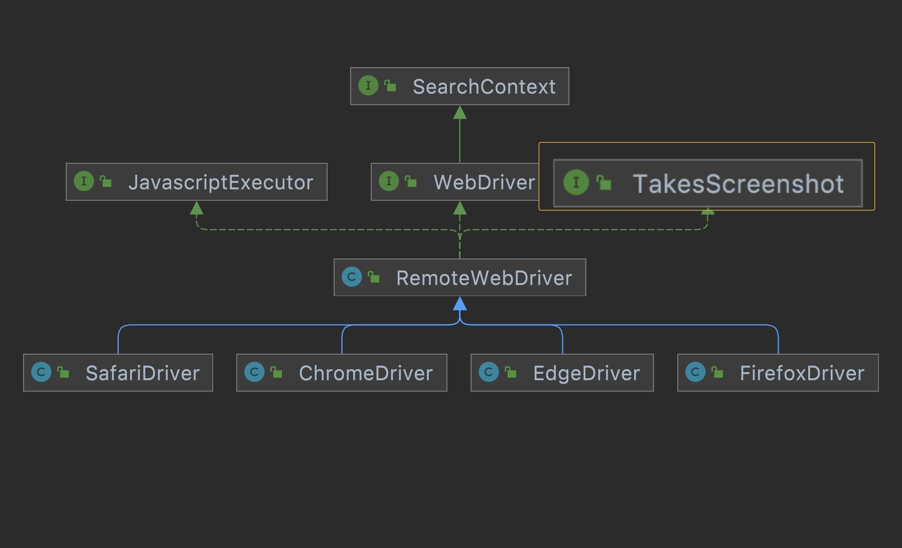

Just like we used, `JavaScriptExecutor` interface for running javascript,
`TakeScreenShot` interface from `import org.openqa.selenium.TakesScreenshot;`
has single method called `getScreenshotAs` to save screenshot of current window.

Here is how it works :
- get a `TakeScreenShot` reference out of `WebDriver` instance
```java
TakesScreenshot takesScreenshot = (TakesScreenshot) Driver.getDriver();
```
- save the file using `getScreenshotAs` method and define `OutputType`.
- here we are selecting output type as byte array because cucumber report expect byte array later when we attach the screenshot to report.
```java
final byte[] screenshot = takesScreenshot.getScreenshotAs(OutputType.BYTES);
```

Let's now take a look at where we can use this screenshot in code.
Logical location will be `@After` hook only if scenario fail.

In all hook methods , we have option to inject a parameter with type of `Scenario`
so we can get scenario information like pass fail and name and so on.

Here is how it looks like :

```java
@After("@ui")
public void tearDown(Scenario scenario){

      //  scenario.isFailed() 
        //  return true if scenario run failed false if not
      // scenario.getName() 
        // reture the name of current scenario
      // scenario.attach( byteArray, "mediaType", "name of screenshot")
        // this is the method that accept 3 arguments 
          //  byteArray represent image
          //  media type , image/png for picture
          //  name  :whatever name we define, we will use scenario name
}
```

We will take screenshot only when scenario fails,
so here is how our final hook `@After(@ui)` method look like

```java
@After("@ui")
public void teardownMethod(Scenario scenario){

        if (scenario.isFailed()) {

        byte[] screenshot = ((TakesScreenshot) Driver.getDriver()).getScreenshotAs(OutputType.BYTES);
        scenario.attach(screenshot, "image/png", scenario.getName());

        }

        System.out.println("---> @After: RUNNING AFTER EACH SCENARIO");

        BrowserUtils.sleep(2);
        Driver.closeDriver();

        }
```

So now if any UI scenario fails, we can view screenshot from the report as below.

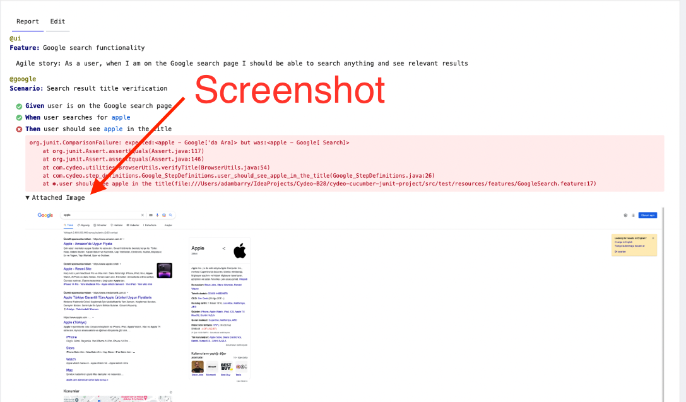

## Rerunning Failed Scenario

Sometimes scenarios can fail due to network issue or any unexpected temporary issues to cause scenario fail.

Sometimes we have failure in code, and we fix the issue by adding new code.

In both above scenario, it makes sense to just run failed scenarios instead of running entire test suite.

In order to do that , we will need to know exactly what scenarios failed,
so we can use that information for next run.

And we will need separate runner just for running those failed scenario we captured from above step.

It's rather simple to capture failed scenario and save it into a text file
using cucumber built-in `rerun` plugin as below:

```
plugin = {"rerun:target/rerun.txt"}
```

In addition to the plugin list we already have, it will do :
1. create a file called `rerun.txt` under target folder
2. store failed scenario inside the text file, so we can use it in separate failed test runner.

So next step is creating `FailedTestRunner` class as below

```java
package com.cydeo.runners;

import io.cucumber.junit.Cucumber;
import io.cucumber.junit.CucumberOptions;
import org.junit.runner.RunWith;

@RunWith(Cucumber.class)
@CucumberOptions(
        features = "@target/rerun.txt",
        glue = "com/cydeo/step_definitions"
)
public class FailedTestRunner {
}
```

Now we have 2 runners classes
- one that run any scenario we specified
- another that run only failed scenarios.
  **Neat!**

## Using Third-Party HTML Reporter

We learned to use built-in simple html report plugin and publish it to temporary location.

There are a lot of third party tools that can take the result of cucumber run
and generate much more gradual report with rich statistic and ui.

Here is the [full list](https://cucumber.io/docs/cucumber/reporting/#third-party-plugins) from the official documentation.


Steps :
- Add the latest dependency into your `pom.xml` file

```xml
  <dependency>
    <groupId>me.jvt.cucumber</groupId>
    <artifactId>reporting-plugin</artifactId>
    <version>7.3.0</version>
</dependency>
```

- As optionally recommended, create a file `cucumber-reporting.properties` under root directory with below content

```properties
# This will become the report name
projectName=Cucumber Automation Framework
# This is optional build number you can add to report
buildNumber=release 1.0
```

- Add the plugin into your `CukesRunner` class as below

```java
package com.cydeo.runners;

import io.cucumber.junit.Cucumber;
import io.cucumber.junit.CucumberOptions;
import org.junit.runner.RunWith;

@RunWith(Cucumber.class)
@CucumberOptions(
        plugin = {
                "html:target/cucumber-reports.html",
                "rerun:target/rerun.txt",
                "me.jvt.cucumber.report.PrettyReports:target/cucumber"
        },
        features = "src/test/resources/features",
        glue = "com/cydeo/step_definitions",
        dryRun = false,
        tags = " @google",
        publish = true //generating a report with public link
)
public class CukesRunner {}

```

Now, you can run using the `CukesRunner` and expect below after test run:
- a new folder called `cucumber` will be created
- it will contain some html files and css, js to support the styling

You can open any of the html file to navigate to the report look as below

## More About Maven

Maven is a powerful tool for java project and dependency management.

We have been primarily using for managing dependencies.

Maven is a command line tool, and it uses command line commands to control build lifecycle.

Here is the [full list of lifecycles available](https://maven.apache.org/guides/introduction/introduction-to-the-lifecycle.html#Build_Lifecycle_Basics)

We only need 2 at this moment as tester.
- `clean`
    - will remove the target folder , compiled src code and other resources
- `test`
    - will gather test resources into `target` folder
    - will compile source code into `target` folder
    - will execute compiled tests according to the setting

You can easily execute the commands directly from IntelliJ
- right tab ->`maven` -> `lifecycles` -> select `one of the options`
- double click to run and view result in console.

If you get warning about `UTF-8` on left side add this to properties section

- ```xml
    <properties>
        <maven.compiler.source>11</maven.compiler.source>
        <maven.compiler.target>11</maven.compiler.target>
        <project.build.sourceEncoding>UTF-8</project.build.sourceEncoding>
    </properties>
  ```

- when you double-click `test` in maven tab
    1. It will use a plugin called surefire plugin bundled with maven (usually we want to add our own with latest version)
    2. Sure fire plugin will look for any classes with name pattern contains
    3. `Test`  `Tests` `TestCases` ..
    4. It's possible to provide much more control over what we want to run by providing configuration options in plugin section of `pom.xml` including parallel run and stuff
    5. adding plugin will allow you to add more configuration option like
    - ignoring test failure, so we can run the whole test without stopping for failure
    - optionally configuring the run order -- alphabetically
    - instructing which Class you want to include in the run
    - by default, it will look for all test classes with these pattern `Test`  `Tests` `TestCases` ..
    - we want to explicitly define run `CukesRunner.java`
    - most importantly instruct maven to run test in parallel
    - `<parallel>methods</parallel>` run parallel at method level
    - `<useUnlimitedThreads>true</useUnlimitedThreads>`  to use all available cpu resources
    - It's possible to run with fixed thread count for example 4 browser at a time
    - `<threadCount>4</threadCount>`
    - `<perCoreThreadCount>false</perCoreThreadCount>` not 4 thread per code but overall 4 browser at a time , this will use less resources that using up all cpu power
    - Make `Driver` utility class Thread-Safe because we want to make sure each thread get their own browser
        - think of it as you have multiple cashier in the store and we want to make sure each cashier have their own cash box so not all cashier end up using one cash box
        - It's like having many fishing rods catching their own fish (@Larisa)
        - it will ensure browsers in each thread in parallel execution does not interfere with each other
        - Using `InheritableThreadLocal` class to wrap up `WebDriver` declaration will allow us to make it thread-safe
            - instead of `private WebDriver obj`  now we do this below
            - `private InheritableThreadLocal<WebDriver> driverPool = new InheritableThreadLocal<>(); `
            - (you can call it whatever you want other than driverPool, it's kinda convention)
                - InheritableThreadLocal will store the object per thread instead of globally
                - It has 2 methods we care about
                    - `get()` will return the current object (`WebDriver`) in this thread , return `null` if does not exist
                    - `set( Object )` will set the current object (`WebDriver`) for this thread
                    - optionally `remove()` will remove the object from current thread , same as `set( null )`
            - For `getDriver` method
                - create new `WebDriver` instance if we don't already have one so it will be as below
                - if `driverPool.get()==null`  then `driverPool.set( new ChromeDriver())`  and so on
            - For `closeBrowser` method
                - close the browser if if we already have browser
                    - if `driverPool.get()!=null` then `driverPool.get().quit()`
                - remove the `WebDriver` instance after closing
                    - `driverPool.set(null)` or `driverPool.remove()`; does the same


## Two Steps to achieve Parallel Execution in cucumber

### Add surefire plugin to Pom.xml

Add it in between the line </dependencies> and </project>

```xml
 <build>
    <plugins>
        <plugin>
            <groupId>org.apache.maven.plugins</groupId>
            <artifactId>maven-surefire-plugin</artifactId>
            <version>3.0.0-M5</version>

            <configuration>
                <parallel>methods</parallel>
                <useUnlimitedThreads>false</useUnlimitedThreads>
                <threadCount>4</threadCount>
                <perCoreThreadCount>false</perCoreThreadCount>
                <!--    <testFailureIgnore>true</testFailureIgnore> -->
                <includes>
                    <include>**/CukesRunner*.java</include>
                </includes>
            </configuration>
        </plugin>
    </plugins>
</build>
```

### Thread-safe `Driver` update

```java
package com.cydeo.utilities;

import org.openqa.selenium.WebDriver;
import org.openqa.selenium.chrome.ChromeDriver;
import org.openqa.selenium.firefox.FirefoxDriver;

import java.time.Duration;

public class Driver {

    //create a private constructor to remove access to this object
    private Driver(){}

    /*
    We make the WebDriver private, because we want to close access from outside the class.
    We are making it static, because we will use it in a static method.
     */
    //private static WebDriver driver; // default value = null

    private static InheritableThreadLocal<WebDriver> driverPool = new InheritableThreadLocal<>();

    /*
    Create a re-usable utility method which will return the same driver instance once we call it.
    - If an instance doesn't exist, it will create first, and then it will always return same instance.
     */
    public static WebDriver getDriver(){

        if(driverPool.get() == null){

            /*
            We will read our browserType from configuration.properties file.
            This way, we can control which browser is opened from outside our code.
             */
            String browserType = ConfigurationReader.getProperty("browser");

            /*
            Depending on the browserType returned from the configuration.properties
            switch statement will determine the "case", and open the matching browser.
             */
            switch (browserType){
                case "chrome":
                    //WebDriverManager.chromedriver().setup();
                    driverPool.set(new ChromeDriver());
                    driverPool.get().manage().window().maximize();
                    driverPool.get().manage().timeouts().implicitlyWait(Duration.ofSeconds(10));
                    break;
                case "firefox":
                    //WebDriverManager.firefoxdriver().setup();
                    driverPool.set(new FirefoxDriver());
                    driverPool.get().manage().window().maximize();
                    driverPool.get().manage().timeouts().implicitlyWait(Duration.ofSeconds(10));
                    break;
            }

        }

        return driverPool.get();

    }

    /*
    Create a new Driver.closeDriver(); it will use .quit() method to quit browsers, and then set the driver value back to null.
     */
    public static void closeDriver(){
        if (driverPool.get()!=null){
            /*
            This line will terminate the currently existing driver completely. It will not exist going forward.
             */
            driverPool.get().quit();
            /*
            We assign the value back to "null" so that my "singleton" can create a newer one if needed.
             */
            driverPool.remove();
        }
    }

}


```


Running maven command line command directly from IntelliJ without local installation.

From the top right corner second icon , `Run Anything` Option :
- `mvn clean`
- `mvn test`
- `mvn clean test`
- `mvn clean test -Dcucumber.filter.tags=@TagYouWantToRun`
    - This will give us option to provide the tag without changing TestRunner

